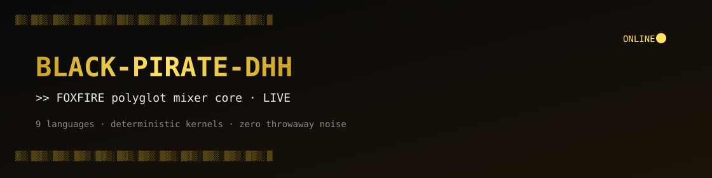
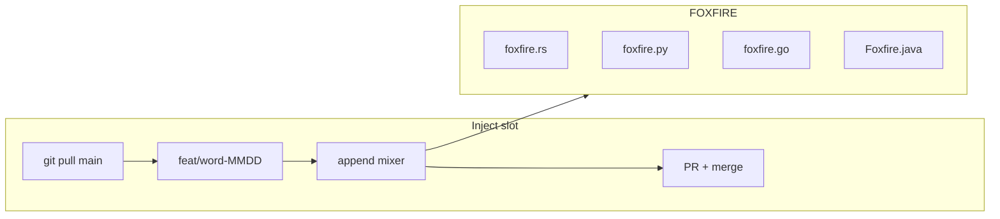

# BLACK-PIRATE-DHH

<p align="center">
  
</p>

<p align="center">
  
  
  
</p>

<p align="center">
  <a href="#design"></a>
  <a href="#matrix"></a>
  <a href="#ops"></a>
  
</p>

**BLACK-PIRATE-DHH** hosts **FOXFIRE** — a single polyglot mixer core.  
Nine languages. Fixed paths. Growth is **append-only functions**, never disposable files.

```text
$ head -3 README.md
# BLACK-PIRATE-DHH
# FOXFIRE = deterministic kernels across a locked language matrix
# contract: same seed → same digest (per language)
```

---

## Status

| Surface | State |
|---------|--------|
| Core paths (`src/*/foxfire.*`) | Locked |
| Inject loop (branch → PR → merge) | Live |
| Cross-lang golden vectors | Planned |
| Public API versioning | `v0.x` (semver-ish tags) |

<p align="center">
  
</p>

---

## Design

FOXFIRE is built around three constraints:

1. **Identity** — one project name, one core per language, forever.
2. **Determinism** — mixers are pure integer kernels (multiply / xor / mod). No I/O, no clocks, no RNG at runtime.
3. **Hygiene** — new work is a function inserted above `main` / `__main__`. The tree does not accumulate `adj_noun_hex` litter.



### File contract

| Layer | Symbol | Role |
|-------|--------|------|
| Core | `foxfire_core` / `foxfireCore` | Stable entry kernel |
| Mixers | `*_mixer_*` / generated ids | Append-only experiments |
| Harness | `main` / `__main__` | Local smoke only |

---

<a id="matrix"></a>

## Language matrix

| Lang | Path | Entry | Notes |
|------|------|-------|-------|
| Rust | [`src/rust/foxfire.rs`](src/rust/foxfire.rs) | `foxfire_core` | `wrapping_mul` + xor |
| C | [`src/c/foxfire.c`](src/c/foxfire.c) | `foxfire_core` | C89-friendly loop |
| C++ | [`src/cpp/foxfire.cpp`](src/cpp/foxfire.cpp) | `foxfire_core` | `std::vector` reduce |
| Go | [`src/go/foxfire.go`](src/go/foxfire.go) | `foxfire_core` | package `main` |
| Python | [`src/python/foxfire.py`](src/python/foxfire.py) | `foxfire_core` | 3.10+ type hints |
| JavaScript | [`src/javascript/foxfire.js`](src/javascript/foxfire.js) | `foxfire_core` | Node / browser |
| Java | [`src/java/Foxfire.java`](src/java/Foxfire.java) | `foxfireCore` | public class stem |
| Ruby | [`src/ruby/foxfire.rb`](src/ruby/foxfire.rb) | `foxfire_core` | Enumerable chain |
| Bash | [`src/bash/foxfire.sh`](src/bash/foxfire.sh) | `foxfire_core` | `set -euo pipefail` |

---

## Install / smoke

```bash
git clone https://github.com/Dls-geek/BLACK-PIRATE-DHH.git
cd BLACK-PIRATE-DHH
```

```bash
python3 src/python/foxfire.py
bash   src/bash/foxfire.sh
# rustc -O src/rust/foxfire.rs -o /tmp/ff && /tmp/ff
# (cd src/go && go run .)
# javac src/java/Foxfire.java && java -cp src/java Foxfire
```

No package manager required for the core. Toolchains are optional and per-language.

---

## Kernel sketch

Minimal shapes — production style, not tutorials.

<details>
<summary><b>Python</b></summary>

```python
def foxfire_core(n: int) -> list[int]:
    """Stable entry. O(n), pure."""
    return [(i * 31) % 997 for i in range(1, n + 1)]


def harbor_kernel(n: int, mult: int = 47, mod: int = 1543) -> list[int]:
    return [(i * mult) % mod for i in range(1, n + 1)]
```
</details>

<details>
<summary><b>Rust</b></summary>

```rust
fn foxfire_core(n: u64) -> u64 {
    let mut acc = 17u64;
    for i in 1..=n {
        acc = (acc.wrapping_mul(31) ^ i) % 997;
    }
    acc
}
```
</details>

<details>
<summary><b>Go</b></summary>

```go
func foxfire_core(n int) int {
	acc := 17
	for i := 1; i <= n; i++ {
		acc = (acc*31 + i) % 997
	}
	return acc
}
```
</details>

<details>
<summary><b>C</b></summary>

```c
int foxfire_core(int n) {
    long acc = 17L;
    for (int i = 1; i <= n; i++)
        acc = (acc * 31L + i) % 997L;
    return (int)(acc % 100000L);
}
```
</details>

---

<a id="ops"></a>

## Ops — inject loop

Slots (Asia/Dhaka, UTC+6):

| Slot | Cron | Branch |
|------|------|--------|
| AM | `17 9 * * *` | `feat/<word>-MMDD` |
| PM | `47 18 * * *` | `feat/<word>-MMDD` |

Pipeline per slot:

```text
pull main → feature branch → append 2..4 mixers → push → PR → merge → delete branch
```

Commit messages follow conventional style scoped by language (`feat(rust): …`, `fix(java): …`).  
PR titles describe the FOXFIRE change, not “auto commit”.

---

## Repository layout

```text
.
├── docs/assets/          # banner + inject demo
├── src/
│   ├── rust/foxfire.rs
│   ├── c/foxfire.c
│   ├── cpp/foxfire.cpp
│   ├── go/foxfire.go
│   ├── python/foxfire.py
│   ├── javascript/foxfire.js
│   ├── java/Foxfire.java
│   ├── ruby/foxfire.rb
│   └── bash/foxfire.sh
├── CHANGELOG.md
├── CONTRIBUTING.md
└── LICENSE
```

---

## Versioning

Tagged releases document README / contract changes. Core ABI is informal at `v0.x`.

| Tag | Note |
|-----|------|
| [`v0.3.0`](https://github.com/Dls-geek/BLACK-PIRATE-DHH/releases/tag/v0.3.0) | Project face + assets |
| [`v0.2.0`](https://github.com/Dls-geek/BLACK-PIRATE-DHH/releases/tag/v0.2.0) | FOXFIRE cores locked |
| [`v0.1.0`](https://github.com/Dls-geek/BLACK-PIRATE-DHH/releases/tag/v0.1.0) | Lab open |

---

## Contributing

Read [CONTRIBUTING.md](CONTRIBUTING.md).

- Prefer a new mixer function on an existing `foxfire.*` file.
- Do not add `src/<lang>/<random>.ext` one-shots.
- Keep kernels pure and small enough to review in one screen.

---

## License

[MIT](LICENSE) © Dls-geek

---

```text
BLACK-PIRATE-DHH  ·  FOXFIRE  ·  >> INJECT
```
