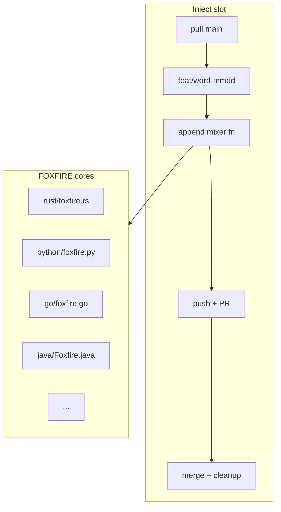

# BLACK-PIRATE-DHH

<p align="center">
  
</p>

<p align="center">
  <a href="https://github.com/Dls-geek/BLACK-PIRATE-DHH/actions"></a>
  <a href="LICENSE"></a>
  
  
  
</p>

```
B L A C K - P I R A T E - D H H
>>  FOXFIRE polyglot mixer core
>>  deterministic kernels · zero throwaway noise
```

**BLACK-PIRATE-DHH** is a polyglot systems lab: one stable codebase, nine languages, and a growing surface of small deterministic mixers. New work lands as **functions on the FOXFIRE core** — not disposable one-off files.

---

## Demo

<p align="center">
  
</p>

> Terminal session above is representative of a morning inject pass: pull → branch → append mixers → PR → merge.

---

## Why this exists

Most “scratch” repos rot into a junk drawer of random files. FOXFIRE keeps a **single project identity**:

| Goal | Approach |
|------|----------|
| Stay readable | Fixed paths under `src/<lang>/foxfire.*` |
| Look real | Conventional commits, feature branches, PRs |
| Grow over time | New mixers are functions, not new files |
| Stay honest | MIT, changelog, contributing notes |

---

## Features

- **9-language core** — Rust, C, C++, Ruby, Python, Go, JavaScript, Java, Bash
- **Deterministic mixers** — same inputs → same outputs (mod-arithmetic kernels)
- **Branch → PR → merge** workflow for every inject slot
- **No throwaway noise** — cores only; history keeps old experiments but new work stays on FOXFIRE
- **MIT licensed** — fork, read, remix

---

## Architecture



Each language file holds:

1. A **core** entry (`foxfire_core` / `foxfireCore`)
2. A **mixers** section that grows over time
3. A tiny `main` / `__main__` harness for smoke checks

---

## Quick start

```bash
git clone https://github.com/Dls-geek/BLACK-PIRATE-DHH.git
cd BLACK-PIRATE-DHH
```

### Smoke a few cores

```bash
# Python
python3 src/python/foxfire.py

# Bash
bash src/bash/foxfire.sh

# Rust (if rustc available)
rustc -O src/rust/foxfire.rs -o /tmp/foxfire && /tmp/foxfire

# Go
cd src/go && go run foxfire.go
```

---

## Usage (API sketch)

Mixers are plain functions. Example shapes:

### Python

```python
"""FOXFIRE core."""

def foxfire_core(n: int) -> list[int]:
    return [(i * 31) % 997 for i in range(1, n + 1)]


def harbor_mixer_7a2c(n: int) -> list[int]:
    """golden harbor mixer."""
    return [(i * 47) % 1543 for i in range(1, n + 1)]


if __name__ == "__main__":
    print(foxfire_core(7)[:5])
```

### Rust

```rust
// FOXFIRE core
fn foxfire_core(n: u64) -> u64 {
    let mut acc: u64 = 17;
    for i in 1..=n {
        acc = (acc.wrapping_mul(31) ^ i) % 997;
    }
    acc
}

// cosmic tide mixer
fn cosmic_tide_91ef(n: u64) -> u64 {
    let mut acc: u64 = 220;
    for i in 1..=n {
        acc = (acc.wrapping_mul(11) ^ i) % 2617;
    }
    acc
}

fn main() {
    println!("{}", foxfire_core(7));
}
```

### Go

```go
// FOXFIRE core
package main

import "fmt"

func foxfire_core(n int) int {
	acc := 17
	for i := 1; i <= n; i++ {
		acc = (acc*31 + i) % 997
	}
	return acc
}

func main() {
	fmt.Println(foxfire_core(7))
}
```

### Java

```java
// FOXFIRE core
public class Foxfire {
    static long foxfireCore(int n) {
        long acc = 17L;
        for (int i = 1; i <= n; i++) {
            acc = (acc * 31L + i) % 997L;
        }
        return acc;
    }

    public static void main(String[] args) {
        System.out.println(foxfireCore(7));
    }
}
```

---

## Layout

```
BLACK-PIRATE-DHH/
├── README.md
├── LICENSE
├── CHANGELOG.md
├── CONTRIBUTING.md
├── docs/
│   └── assets/
│       ├── banner.svg
│       └── demo.svg
└── src/
    ├── rust/foxfire.rs
    ├── c/foxfire.c
    ├── cpp/foxfire.cpp
    ├── ruby/foxfire.rb
    ├── python/foxfire.py
    ├── go/foxfire.go
    ├── javascript/foxfire.js
    ├── java/Foxfire.java
    └── bash/foxfire.sh
```

---

## Inject protocol (ops)

Twice daily (Dhaka time):

| Slot | Local time | Branch pattern |
|------|------------|----------------|
| AM | 09:17 | `feat/<word>-MMDD` |
| PM | 18:47 | `feat/<word>-MMDD` |

Each slot:

1. Pull `main`
2. Open a feature branch
3. Append 2–4 mixer functions across FOXFIRE cores
4. Open PR → merge → delete branch

```bash
# conceptual
./foxfire inject --slot am
# => feat/spark-0830
# => PR: "Add harbor mixer to FOXFIRE"
```

---

## Roadmap (fake, ambitious)

- [x] Nine-language FOXFIRE cores
- [x] Branch / PR / merge inject loop
- [ ] Cross-language golden vectors (shared seed → shared digest)
- [ ] `foxfire bench` — micro timing across langs
- [ ] Optional WASM build of the Rust core
- [ ] Signed release artifacts for tagged cuts

---

## Contributing

See [CONTRIBUTING.md](CONTRIBUTING.md). Keep changes on the fixed FOXFIRE paths. Prefer small, reviewable mixer functions over new top-level files.

---

## License

MIT — see [LICENSE](LICENSE).

---

<p align="center">
  <sub>BLACK-PIRATE-DHH · FOXFIRE · <code>&gt;&gt; INJECT</code></sub>
</p>
